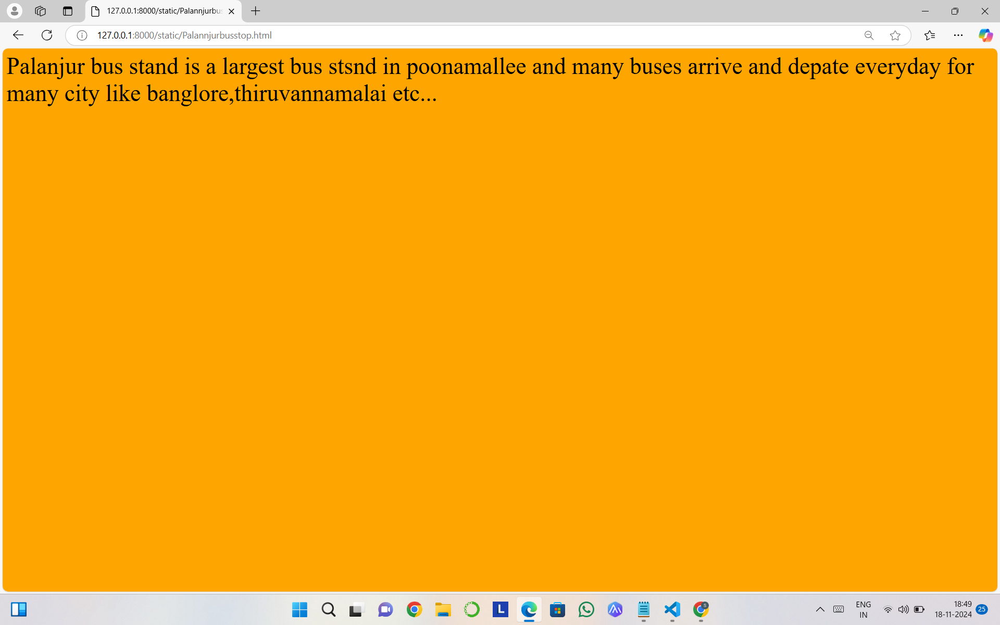
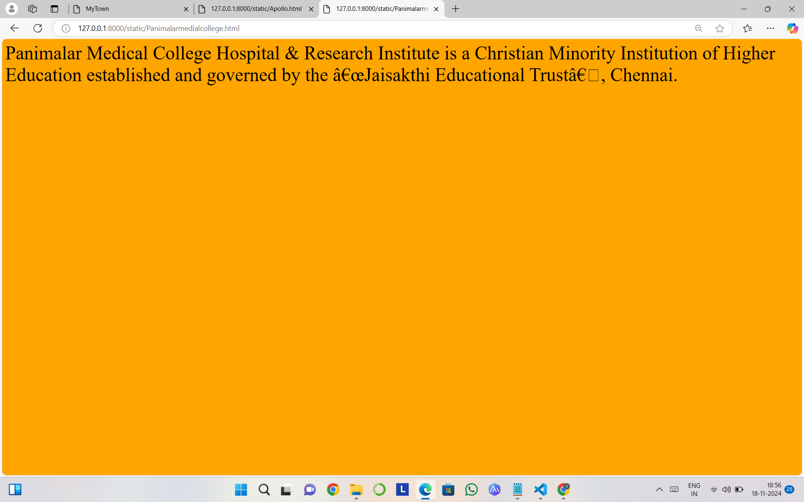

# Ex04 Places Around Me
## Date: 

## AIM
To develop a website to display details about the places around my house.

## DESIGN STEPS

### STEP 1
Create a Django admin interface.

### STEP 2
Download your city map from Google.

### STEP 3
Using ```<map>``` tag name the map.

### STEP 4
Create clickable regions in the image using ```<area>``` tag.

### STEP 5
Write HTML programs for all the regions identified.

### STEP 6
Execute the programs and publish them.

## CODE
```
map.html

<html>
    <head>
        <title>MyTown</title>
    </head>
    <body>
        <h1 align="center">
            <font color="yellow"><b>Sriperembudur</b></font>
        </h1>
        <h3 align="center"> 
            <font color="blue">Sunil A (24900526)</font>
        </h3>
        <center>
    
    
    <map name="MyTown">
        <area target="" alt="CIT" title="CIT" href="CIT.html" coords="602,789,833,881" shape="rect">
        <area target="" alt="Queensland" title="Queensland" href="Queensland.html" coords="454,231,692,309" shape="rect">
        <area target="" alt="EVP" title="EVP" href="EVP.html" coords="807,213,992,254" shape="rect">
        <area target="" alt="Apollo" title="Apollo" href="Apollo.html" coords="229,180,448,274" shape="rect">
        <area target="" alt="Panimalarmedialcollege" title="Panimalarmedialcollege" href="Panimalarmedialcollege.html" coords="875,17,1136,72,562,353,786,399" shape="rect">
        <area target="" alt="Palannjurbusstop" title="Palannjurbusstop" href="Palannjurbusstop.html" coords="562,352,792,399" shape="rect">
    
    </map>
    </center>
    </body>
    </html>

    Apollo.html

    <html>
<body bgcolor="yellow">
    <font size="100">
<p>
    Apollo Group of Colleges is committed to impart education in such a way that our students are extolled everywhere. With this lofty vision, the Arts & Sciences College is having state-of-the-art infrastructural facilities in a sprawling and sylvan campus that will facilitate teaching and learning of the greatest order.
</p>
</font>
</body>
</html>

Queensland.html


<html>
<body bgcolor="Green">
    <font size="100">
<p> "Queensland boasts notable attractions such as the Free Fall Tower, Alpen Blitz, Cable Cars, and several water rides, adding to the excitement. Operating hours: Monday (closed for maintenance); Tuesday to Sunday: 9:30 a.m. to 6:00 p.m. Entry fee: Adults: INR 750; Kids: INR 650.13 Feb 2024"</p>
</font>
</body>
</html>


CIT.html


<html>
<body bgcolor="cyan">
<font size="100">
    <p>
        Chennai Institute of technology, the best engineering college in Chennai was established with the objective of providing quality technical education with adequate industrial exposure than any other engineering colleges in Chennai, caters the needs of the youth with its innovative teaching methods.
    </p>
</font>
</body>
</html>


palannjurbusstop.html


<html>
<body bgcolor="orange">
    <font size="100">
    <p>Palanjur bus stand is a largest bus stsnd in poonamallee and many buses arrive and depate everyday for many city like banglore,thiruvannamalai etc...</p>
    </font>
</body>
</html>

EVP.html

<html>
<body bgcolor="pink">
    <font size="100">
        <p>
            Evp Cinema Hall in Chennai is one of the leading businesses in the Cinema Halls. Also known for Cinema Halls, Tamil Movies, Amaran (Tamil Movie), Telugu Movies, Bloody Beggar (Tamil Movie), KA (2024 Film) (Telugu Movie), Lucky Baskhar (Tamil Movie) and much more.
        </p>
    </font>
</body>
</html>

Panimalarmedicalcollege.html


<html>
<body bgcolor="orange">
    <font size="100">
        <p>
            Panimalar Medical College Hospital & Research Institute is a Christian Minority Institution of Higher Education established and governed by the “Jaisakthi Educational Trust”, Chennai.
        </p>
    </font>
</body>
</html>
    

```


## OUTPUT





## RESULT
The program for implementing image maps using HTML is executed successfully.
